# @anb98/rn-toast

[](https://www.npmjs.com/package/@anb98/rn-toast)
[](LICENSE)
[](src/index.ts)

A toast library for React Native with a queue, pluggable transitions, slots and strict typing. No native code, no runtime dependencies, no animation library required.

<p align="center">
  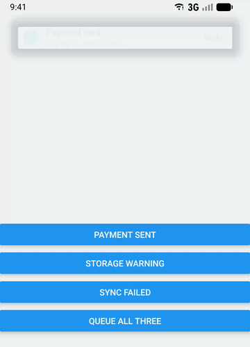
</p>

## Quick path

1. Install:

   ```sh
   npm install @anb98/rn-toast
   # or
   yarn add @anb98/rn-toast
   # or
   pnpm add @anb98/rn-toast
   ```

   Peer dependencies: `react >=18.0.0`, `react-native >=0.72.0`.

2. Wrap your app once and show toasts from anywhere:

   ```tsx
   import { Button, View } from 'react-native'
   import { ToastProvider, toast } from '@anb98/rn-toast'

   export function App() {
     return (
       <ToastProvider>
         <View style={{ flex: 1, justifyContent: 'center' }}>
           <Button title="Save" onPress={() => toast.show({ title: 'Saved', variant: 'success' })} />
         </View>
       </ToastProvider>
     )
   }
   ```

3. Verify: pressing the button shows a toast at the top of the screen. It disappears after 3 seconds or when tapped.

## `ToastProvider` props

Every prop except `children` and `variants` is also accepted per toast in `toast.show(...)` (see [`toast.show` options](#toastshow-options)). Precedence, lowest to highest: library defaults, Provider, `variants[variant]`, the `show` call. `undefined` never overrides a lower level.

| Prop          | Type                                              | Default         | Description                                                                 |
| ------------- | ------------------------------------------------- | --------------- | --------------------------------------------------------------------------- |
| `children`    | `ReactNode`                                       | required        | Your app. Toasts render in an overlay above it.                             |
| `duration`    | `number`                                          | `3000`          | Milliseconds visible. `Infinity` keeps the toast until dismissed.           |
| `dismissible` | `boolean`                                         | `true`          | Tap or accessibility escape dismisses the toast.                            |
| `insets`      | `Partial<ToastInsets>`                            | all `0`         | Safe area insets. Only `top`, `left` and `right` are used.                  |
| `offset`      | `number`                                          | `20`            | Extra gap below the top inset.                                              |
| `transition`  | `ComponentType<ToastTransitionProps>`             | passthrough     | Enter and exit animation wrapper. See [Transitions](#transitions).          |
| `variants`    | `Partial<Record<ToastVariant, ToastDefaults>>`    | `undefined`     | Per-variant defaults (slots, styles, duration, transition...).              |
| `onShow`      | `(toast: ToastRecord) => void`                    | `undefined`     | Called once when a toast becomes visible.                                   |
| `onHide`      | `(toast: ToastRecord) => void`                    | `undefined`     | Called once when a shown toast starts exiting.                              |
| `onError`     | `(error: unknown, toast: ToastRecord) => void`    | `undefined`     | Called when an action handler throws or rejects.                            |
| slots         | see [Slots](#slots)                               | built-in view   | `renderToast`, `icon`, `renderTitle`, `renderDescription`, `renderAction`.  |
| styles        | see [Styles](#styles)                             | built-in styles | `containerStyle`, `titleStyle`, `descriptionStyle`, `actionStyle`, `actionLabelStyle`. |

## API

| Method                          | Description                                                                              |
| ------------------------------- | ---------------------------------------------------------------------------------------- |
| `toast.show(options)`           | Shows a toast and returns its id. Showing a live id replaces its options.                |
| `toast.update(id, patch)`       | Merges the defined keys of `patch` into a live toast and restarts its timer.             |
| `toast.dismiss(id)`             | Dismisses a toast. Queued toasts are removed; visible ones exit.                         |
| `toast.clear()`                 | Dismisses visible toasts and drops queued ones.                                          |
| `toast.promise(promise, msgs)`  | Shows `loading`, then replaces it with `success` or `error`. Returns the original promise. |
| `useToast()`                    | Same API as `toast`, for code inside a `ToastProvider`. Throws outside one.              |

### `toast.show` options

| Option        | Type                                           | Default                      | Description                                                                         |
| ------------- | ---------------------------------------------- | ---------------------------- | ----------------------------------------------------------------------------------- |
| `title`       | `string`                                       | required                     | Main text.                                                                          |
| `description` | `string`                                       | `undefined`                  | Secondary text below the title.                                                     |
| `variant`     | `ToastVariant`                                 | `'info'`                     | `'info'`, `'success'`, `'warning'`, `'error'` or your own. See [Variants](#variants). |
| `id`          | `string`                                       | generated                    | Showing an id that is still live replaces that toast instead of adding another.     |
| `action`      | `{ label: string, onPress: () => void \| Promise<void> }` | `undefined`       | Renders an action button. The toast dismisses after `onPress` settles.              |
| `payload`     | `TPayload`                                     | `undefined`                  | Custom data for your slots. Typed by `createToast<TPayload>()`.                     |
| `duration`    | `number`                                       | Provider, then `3000`        | Milliseconds visible. `Infinity` keeps the toast until dismissed.                   |
| `dismissible` | `boolean`                                      | Provider, then `true`        | Tap or accessibility escape dismisses the toast.                                    |
| `insets`      | `Partial<ToastInsets>`                         | Provider, then all `0`       | Safe area insets for this toast.                                                    |
| `offset`      | `number`                                       | Provider, then `20`          | Extra gap below the top inset.                                                      |
| `transition`  | `ComponentType<ToastTransitionProps>`          | Provider, then passthrough   | Animation wrapper for this toast. See [Transitions](#transitions).                  |
| `onShow`      | `(toast: ToastRecord) => void`                 | `undefined`                  | Called once when this toast becomes visible, before the Provider's `onShow`.        |
| `onHide`      | `(toast: ToastRecord) => void`                 | `undefined`                  | Called once when this toast starts exiting, before the Provider's `onHide`.         |
| `onError`     | `(error: unknown, toast: ToastRecord) => void` | `undefined`                  | Called when `action.onPress` throws or rejects, before the Provider's `onError`.    |
| slots         | see [Slots](#slots)                            | Provider, then built-in view | `renderToast`, `icon`, `renderTitle`, `renderDescription`, `renderAction`.          |
| styles        | see [Styles](#styles)                          | Provider, then built-in      | `containerStyle`, `titleStyle`, `descriptionStyle`, `actionStyle`, `actionLabelStyle`. |

"Provider, then X" means the value falls back to `variants[variant]`, then the `ToastProvider` prop, then the library default `X`. Per-toast and Provider callbacks both fire; neither replaces the other.

```tsx
const id = toast.show({
  title: 'Message deleted',
  description: 'It will be removed in 5 seconds.',
  variant: 'warning',
  duration: 5000,
  action: { label: 'Undo', onPress: restoreMessage },
  onError: (error) => report(error)
})
```

`toast.update(id, patch)` and the `toast.promise` messages accept the same options, except `id`.

### Actions

An `action` renders a button on the right. Pressing it runs `onPress`, then dismisses the toast.

```tsx
toast.show({
  title: 'Message deleted',
  description: 'It will be removed in 5 seconds.',
  duration: 5000,
  action: { label: 'Undo', onPress: restoreMessage }
})
```

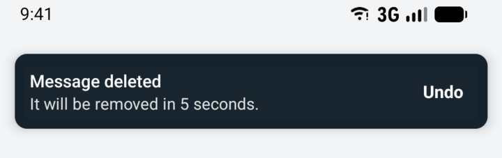

### Promises

`toast.promise` shows a sticky loading toast and replaces it in place when the promise settles.

```tsx
toast.promise(save(), {
  loading: 'Saving...',
  success: (value) => ({ title: 'Saved', description: `Record ${value.id}`, variant: 'success' }),
  error: (error) => `Failed: ${String(error)}`
})
```

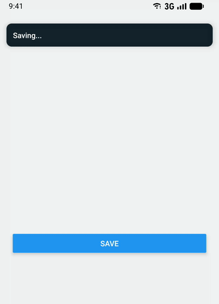

### Using ids

`toast.show()` returns the toast's id. Keep it to act on that toast later:

```tsx
const id = toast.show({ title: 'Uploading 0%', duration: Infinity })
onProgress((percent) => toast.update(id, { title: `Uploading ${percent}%` }))
onDone(() => toast.dismiss(id))
```

Pass your own `id` to avoid duplicates. While a toast with that id is live, showing it again replaces it instead of queueing another:

```tsx
toast.show({ id: 'offline', title: 'No connection', variant: 'error' })
```

Report progress by updating the same toast:

```tsx
// From examples/toast-ids.tsx
async function uploadWithProgress() {
  const id = toast.show({ title: 'Uploading 0%', duration: Infinity })
  for (const progress of [25, 50, 75, 100]) {
    await wait(500)
    toast.update(id, { title: `Uploading ${progress}%` })
  }
  toast.update(id, { title: 'Upload complete', variant: 'success', duration: 3000 })
}
```

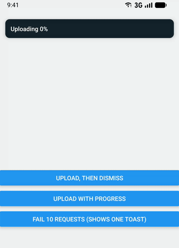

Full example: [examples/toast-ids.tsx](examples/toast-ids.tsx)

### Using payload

`payload` carries your own data to your slots. The library never reads it. Type it with `createToast<TPayload>()`; the default instance does not accept a payload.

```tsx
// From examples/custom-payload.tsx
const { ToastProvider, toast } = createToast<MessagePayload>()

<ToastProvider
  icon={({ toast: { payload } }) =>
    payload ? (
      <Image
        source={{ uri: payload.avatarUrl }}
        style={{ width: 32, height: 32, borderRadius: 16 }}
      />
    ) : null
  }
>
```

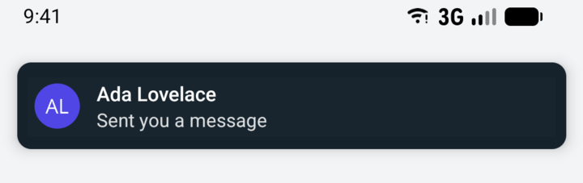

Full example: [examples/custom-payload.tsx](examples/custom-payload.tsx)

### `createToast`

The default `ToastProvider`, `useToast` and `toast` share one instance. Create isolated instances with their own queue, options and payload type:

```tsx
import { createToast } from '@anb98/rn-toast'

const { ToastProvider, toast } = createToast<{ avatarUrl: string }>({
  exitTimeout: 1500,
  queue: { select: ({ occupying, pending }) => ({ activate: occupying.length < 2 ? pending.slice(0, 1).map((record) => record.id) : [] }) }
})
```

| Option        | Type                     | Default | Description                                                              |
| ------------- | ------------------------ | ------- | ------------------------------------------------------------------------ |
| `queue`       | `QueueStrategy<TPayload>` | FIFO, one at a time | Decides which pending toasts become active, and which to `drop`. |
| `exitTimeout` | `number`                 | `1000`  | Milliseconds to wait for a transition's `onExited` before freeing the slot. |

See [`examples/custom-payload.tsx`](examples/custom-payload.tsx).

## Slots

Each slot receives `{ toast, dismiss, pressAction }`. A slot replaces only its own part, except `renderToast`, which replaces the whole toast.

| Slot                | Replaces                                                        |
| ------------------- | --------------------------------------------------------------- |
| `renderToast`       | Everything inside the transition wrapper.                       |
| `icon`              | Leading icon. A node or a slot function. No icon by default.    |
| `renderTitle`       | Title text.                                                     |
| `renderDescription` | Description text.                                               |
| `renderAction`      | Action button. Call `pressAction()` to run the handler and dismiss. |

`pressAction()` awaits `action.onPress`, routes errors to `onError`, then dismisses. A second press while it runs is ignored.

## Styles

`containerStyle`, `titleStyle`, `descriptionStyle`, `actionStyle` and `actionLabelStyle` accept any `StyleProp`. Styles merge in precedence order, so a per-call `titleStyle` overrides only the keys it sets. There is no `className` or theme support.

### Styled example

Styles, a per-variant `icon` through `variants`, a `renderAction` slot and a custom transition combine into a branded toast:

```tsx
// From examples/styled-toast.tsx — styles omitted, see the full file
<ToastProvider
  variants={VARIANTS}
  transition={LiftTransition}
  containerStyle={styles.container}
  titleStyle={styles.title}
  descriptionStyle={styles.description}
  renderAction={({ toast: { action }, pressAction }) => (
    <Pressable
      accessibilityRole="button"
      hitSlop={8}
      onPress={() => void pressAction()}
      style={styles.action}
    >
      <Text style={styles.actionLabel}>{action?.label}</Text>
    </Pressable>
  )}
>
```

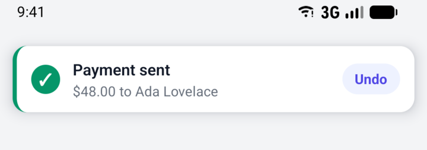

Full example: [examples/styled-toast.tsx](examples/styled-toast.tsx)

## Variants

Built in: `info` (default), `success`, `warning`, `error`.

```tsx
toast.show({ title: 'New version available', description: 'Restart the app to update.', variant: 'info' })
toast.show({ title: 'Profile saved', description: 'Your changes are live.', variant: 'success' })
toast.show({ title: 'Low battery', description: '15% remaining. Plug in soon.', variant: 'warning' })
toast.show({ title: 'Upload failed', description: 'The file is larger than 10 MB.', variant: 'error' })
```

<p>
  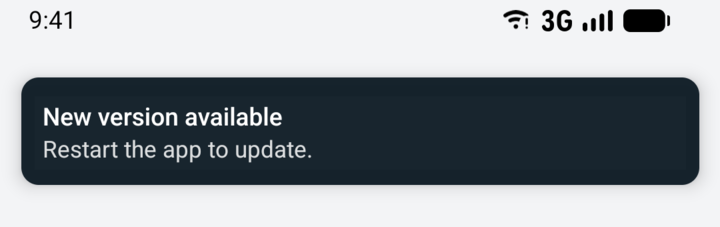
  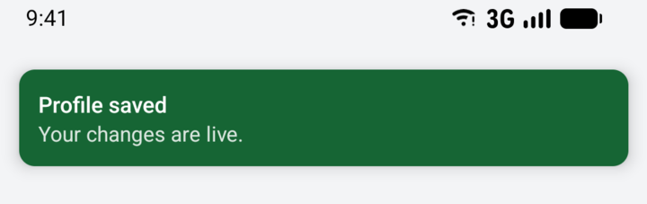
  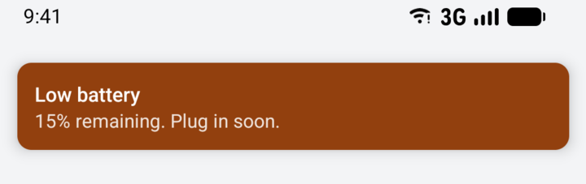
  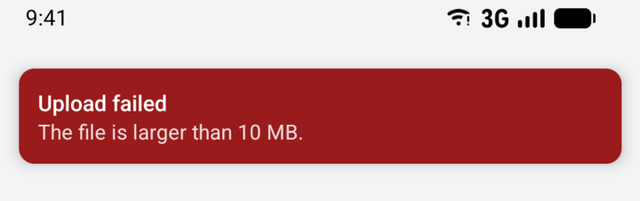
</p>

Add your own with declaration merging, then style it through `variants`:

```tsx
import { ToastProvider, toast } from '@anb98/rn-toast'

declare module '@anb98/rn-toast' {
  interface ToastVariants {
    brand: true
  }
}

<ToastProvider variants={{ brand: { containerStyle: { backgroundColor: '#4F46E5' } } }}>
  {/* toast.show({ title: 'Hi', variant: 'brand' }) */}
</ToastProvider>
```

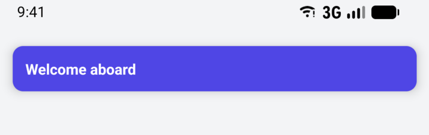

Full example: [examples/custom-variant.tsx](examples/custom-variant.tsx). The augmentation is global to the program, so every instance accepts the new variant.

## Transitions

A transition is a component that wraps the toast and receives:

| Prop       | Type                                            | Description                                                      |
| ---------- | ----------------------------------------------- | ---------------------------------------------------------------- |
| `phase`    | `'entering' \| 'visible' \| 'exiting'`          | Lifecycle phase of this toast.                                   |
| `onExited` | `() => void`                                    | Call when the exit animation finishes. Required to free the slot. |
| `dismiss`  | `() => void`                                    | Starts the exit, for gestures such as swipe.                     |
| `children` | `ReactNode`                                     | The toast view.                                                  |

The toast stays mounted until `onExited` is called. If it never is, the slot is freed after `exitTimeout` (default 1000 ms) and a warning naming the toast id is logged in development.

| Example                                                          | Approach                                         |
| ---------------------------------------------------------------- | ------------------------------------------------ |
| [`animated-transition.tsx`](examples/animated-transition.tsx)    | React Native `Animated` fade and slide.          |
| [`reanimated-transition.tsx`](examples/reanimated-transition.tsx) | Reanimated with `runOnJS(onExited)`.             |
| [`swipe-to-dismiss.tsx`](examples/swipe-to-dismiss.tsx)          | `PanResponder` plus `dismiss`.                   |
| [`styled-toast.tsx`](examples/styled-toast.tsx)                  | Spring in, fade out, with `Animated`.            |

With Reanimated, set `collapsable={false}` on the animated wrapper so Android does not flatten the view.

<p>
  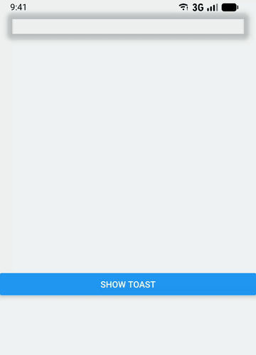
  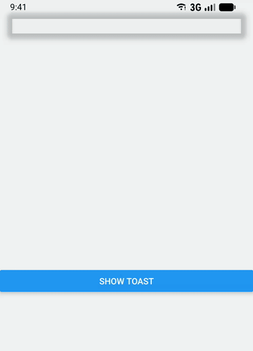
  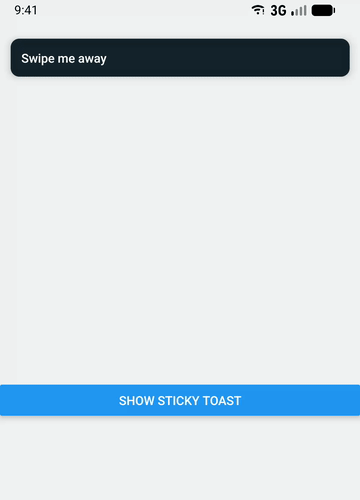
</p>

**React Native `Animated`**

```tsx
// From examples/animated-transition.tsx
useEffect(() => {
  const exiting = phase === 'exiting'
  const animation = Animated.timing(progress, {
    toValue: exiting ? 0 : 1,
    duration: DURATION,
    useNativeDriver: true
  })
  animation.start(({ finished }) => {
    if (exiting && finished) onExited()
  })
  return () => animation.stop()
}, [phase, progress, onExited])
```

Full example: [examples/animated-transition.tsx](examples/animated-transition.tsx)

**Reanimated**

```tsx
// From examples/reanimated-transition.tsx
useEffect(() => {
  if (phase === 'exiting') {
    progress.value = withTiming(0, { duration: DURATION }, (finished) => {
      if (finished) runOnJS(onExited)()
    })
  } else {
    progress.value = withTiming(1, { duration: DURATION })
  }
}, [phase, progress, onExited])
```

Full example: [examples/reanimated-transition.tsx](examples/reanimated-transition.tsx)

**Swipe to dismiss**

```tsx
// From examples/swipe-to-dismiss.tsx
onPanResponderRelease: (_event, { dx }) => {
  if (Math.abs(dx) > DISMISS_DISTANCE) {
    direction.current = dx < 0 ? -1 : 1
    dismiss()
  } else {
    Animated.spring(translateX, { toValue: 0, useNativeDriver: false }).start()
  }
}
```

Full example: [examples/swipe-to-dismiss.tsx](examples/swipe-to-dismiss.tsx)

## Queue strategies

The default strategy shows one toast at a time in FIFO order. A strategy receives `{ occupying, pending }` records and returns `{ activate, drop? }` ids; drops apply before activations.

```tsx
const { ToastProvider, toast } = createToast({
  queue: { select: ({ pending }) => ({ activate: pending.slice(0, 1).map((r) => r.id), drop: pending.slice(3).map((r) => r.id) }) }
})
```

## Safe area

The library does not depend on `react-native-safe-area-context`. Pass the insets yourself:

```tsx
import { useSafeAreaInsets } from 'react-native-safe-area-context'
import type { ReactNode } from 'react'
import { ToastProvider } from '@anb98/rn-toast'

function Toasts({ children }: { children: ReactNode }) {
  const insets = useSafeAreaInsets()
  return <ToastProvider insets={insets}>{children}</ToastProvider>
}
```

Without insets, toasts sit `offset` points from the top edge. `bottom` is accepted but ignored.

## Accessibility

- The toast wrapper has `accessibilityRole="alert"` and a polite live region.
- iOS announces title and description through `AccessibilityInfo.announceForAccessibility` once when the toast becomes visible, and again only if the text changes.
- Dismissible toasts expose a button role and handle `onAccessibilityEscape`.
- The icon is hidden from assistive technology.

## Limitations

- Toasts render in an overlay inside `ToastProvider`, so they appear under native `Modal`s and native-stack screens. Mount another `ToastProvider` inside the Modal content: the most recently mounted Provider renders the overlay, and the previous one resumes when it unmounts.
- Nested Providers that mount in the same render leave the outer one active, because effects attach children first. Mount the inner Provider after the outer one.
- Toasts appear at the top only. There is no `position` option.
- Variants are registered globally through declaration merging, not per instance.
- If an action handler re-shows the same id, the `finally` dismiss also dismisses the re-shown toast.
- Android live region announcements and iOS `onAccessibilityEscape` are device behaviors that automated tests do not cover.
- The `examples/` files are not type-checked by the repository tooling.

## License

MIT © 2026 Abdiel Martinez
